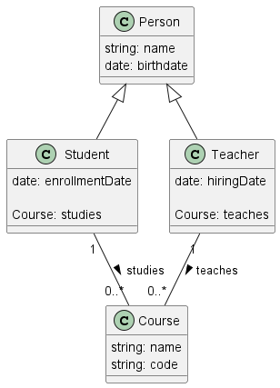

# 📕Documentation: school

Module responsible for managing a school's entities

## 🌀 Package's Data Model

### ⚡Entities

* **Person** : -
* **Student** : Represents a Student
* **Teacher** : Represents a Teacher
* **Course** : Represents a Course
